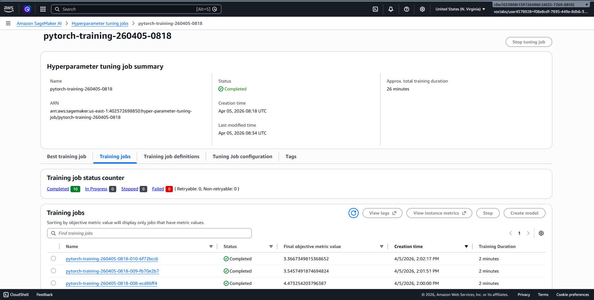
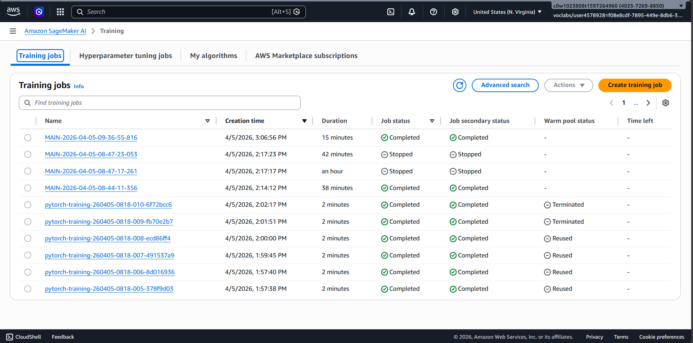
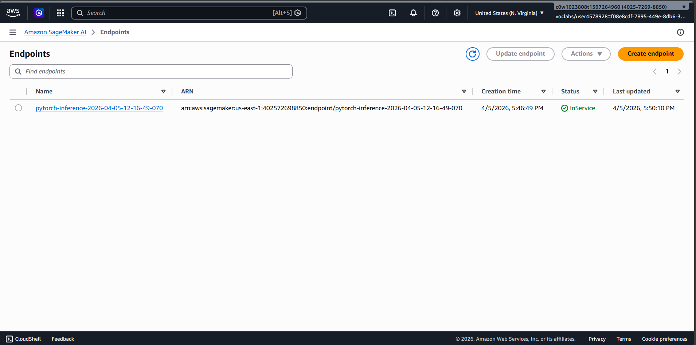

# Image Classification using AWS SageMaker

Use AWS SageMaker to train a pretrained model that can perform image classification by using the SageMaker profiling, debugger, hyperparameter tuning and other good ML engineering practices. This project uses the dog breed classification dataset.

## Project Set Up and Installation

Enter AWS through the gateway in the course and open SageMaker Studio.
Download the starter files.
Download/Make the dataset available.

## Dataset

The provided dataset is the dog breed classification dataset which contains 133 dog breeds.
The dataset was downloaded and uploaded to an S3 bucket for SageMaker access.

### Access

The dataset was uploaded to S3 bucket `sagemaker-us-east-1-402572698850` so that SageMaker has access to the data.

## Hyperparameter Tuning

We used the ResNet50 model to perform image classification. Hyperparameter search was performed using the `hpo.py` script to find the optimal values for the following hyperparameters:

- **Learning Rate**: Searched over a continuous range from `0.001` to `0.1`
- **Batch Size**: Searched over categorical values `[16, 32, 64, 128, 256, 512]`
- **Early Stopping Rounds**: Searched over categorical values `[10, 12, 20]`

The HPO job ran on `ml.g4dn.xlarge` instance with `max_jobs=10` and `max_parallel_jobs=2`.

The best hyperparameters found were:
- **Learning Rate**: `0.0040375460509109555`
- **Batch Size**: `128`
- **Early Stopping Rounds**: `20`



## Training

The model was trained using the `train_model.py` script with the best hyperparameters from HPO. The model was trained on a `ml.g4dn.xlarge` GPU instance with SageMaker Debugger and Profiler enabled.



## Debugging and Profiling

### Debugging

Model debugging was done using the `smdebug` library. We registered the model by creating an SMDebug hook in the main function and passed this hook to the train and test functions with `TRAIN` and `EVAL` modes respectively.

The following debugger rules were configured:
- VanishingGradient
- Overfit
- Overtraining
- PoorWeightInitialization

The following tensors were tracked:
- `CrossEntropyLoss_output_0`
- `gradient/ResNet_fc.0.bias`
- `gradient/ResNet_fc.0.weight`
- `gradient/ResNet_fc.2.bias`
- `gradient/ResNet_fc.2.weight`
- ReLU inputs across layers

### Profiling

Using SageMaker Profiler, we monitored instance metrics, GPU/CPU utilization and memory utilization. Profiler rules and configurations were created and the output is an HTML report.

### Results

The profiler report revealed that the model was underutilising the GPU. Recommendations were to either increase the batch size or use a smaller instance type to better utilize resources.

If anomalous behaviour is detected in debugging output, it can be investigated by viewing the CloudWatch logs and adjusting the training code accordingly.

## Model Deployment

The deployed model is a PyTorch CNN model based on ResNet50, fine-tuned for the Dog Breed Classification task. It has a linear fully connected output layer with output size 133 (one per dog breed).

- **Endpoint name**: `pytorch-inference-2026-04-05-12-16-49-070`
- **Instance type**: `ml.m5.large`
- **Learning Rate**: `0.0040375460509109555`
- **Batch Size**: `128`
- **Early Stopping Rounds**: `20`



To query the endpoint:

```python
from sagemaker.predictor import Predictor
import sagemaker

jpeg_serializer = sagemaker.serializers.IdentitySerializer("image/jpeg")
json_deserializer = sagemaker.deserializers.JSONDeserializer()

predictor = Predictor(
    endpoint_name="pytorch-inference-2026-04-05-12-16-49-070",
    serializer=jpeg_serializer,
    deserializer=json_deserializer
)
```

To get a prediction, fetch an image and pass the raw bytes:

```python
import requests
import numpy as np

img_bytes = requests.get("IMAGE_URL").content
response = predictor.predict(img_bytes, initial_args={"ContentType": "image/jpeg"})
predicted_class = np.argmax(response)
print(predicted_class)
```
